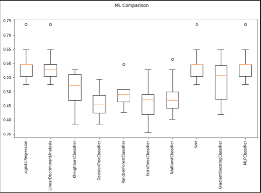
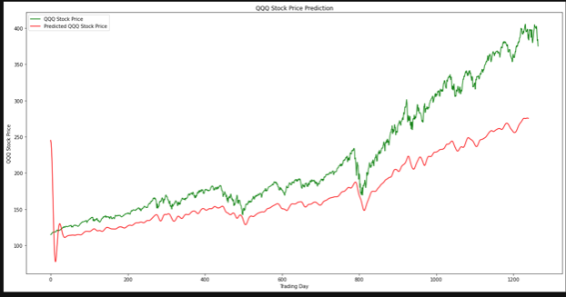
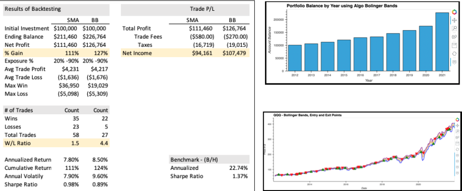
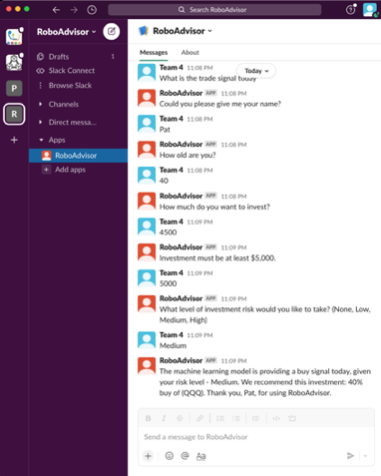

# Machine Learning Algorithmic Trader


Photo Credits [License](https://inc42.com/datalab/how-robo-advisors-are-changing-the-financial-advice-industry-in-india/)

## Executive Summary
[Presentation](https://github.com/patmbee/ml_project_2/blob/main/Presentation.pdf)
### Overview
We completed an end-to-end machine learning project of algorithmic trading strategies. The project spans from ideation and feature engineering to model optimization, strategy design and backtesting. In addition to meeting our goal of identifying a profitable active trading strategy, we also deepened our proficiency and confidence in this challenging area of FinTech. 

### Signals
The project developed strategies to validate and predict entry and exits points of the Investco QQQ ETF using two technical indicators, SMA Crossover and Bollinger Bands. We then compared the results. We evaluated and backtested several machine learning libraries and selected the two with the highest accuracy. 

### ML
We found the best results from using a combination of Deep Neural Multilayer Perceptron (MLP), Long Short-term Memory (LSTM) and a Support Vector Machine (SVM). By backtesting simulated historical trades we concluded Bollinger Bands outperforms SMA crossover. With additional effort we could test our theory that combining Bollinger Bands with another technical indicator would outperform the single technical indicator alone.

### Robo-Advisor
Finally we provide a beta integration of an Amazon Lex Chatbox and Slack to pass a predictive trade signal directly to a user’s fingertips.

### Images in Presentation








____
## Technologies
This is a Python v 3.7 Machine Learning project using several libraries and modules. 

####  Modules
```
import pandas as pd
import numpy as np
import hvplot.pandas
import matplotlib.pyplot as plt
import datetime
from pandas_datareader import data as pdr
import yfinance as yf
from pandas.tseries.offsets import DateOffset
from sklearn.preprocessing import StandardScaler
from sklearn.metrics import classification_report
from sklearn import svm
from sklearn.svm import SVC
from numpy import newaxis
from core.utils import Timer
from keras.layers import Dense, Activation, Dropout, LSTM
from keras.models import Sequential, load_model
from keras.callbacks import EarlyStopping, ModelCheckpoint
from ticker_utils import get_data
from ticker_utils import create_bollinger_bands
from ticker_utils import create_signal_using_bollinger

```
####  APIs and Datasources
The project also leverages three years of daily stocks trades from Yahoo! Finanace for the symbols in the Portfolio and the S&P 500 Index.
* alphavantage
* yfinance

#### Coding
* [Models](https://github.com/patmbee/ml_project_2/tree/main/Models)

* [LSTM](https://github.com/patmbee/ml_project_2/tree/main/LSTM)

* [RoboAdvisor](https://github.com/patmbee/ml_project_2/tree/main/AWS)


[Integrate AWS Chatbot with Slack](https://docs.aws.amazon.com/lex/latest/dg/slack-bot-association.html)


___
## Installation Guide
The project requires the following environments to be installed in the main project file via a command line system:

```
conda create -n project python=3.7 anaconda -y
conda activate project
conda install -c pyviz hvplot geoviews
pip install python-dotenv
pip install alpaca-trade-api
conda install -c anaconda requests
conda install ipykernel
conda install nb_conda_kernels
conda install dash
conda install -c plotly jupyter-dash
conda install -c plotly jupyterlab-dash
pip install streamlit
pip install streamlit-aggrid
conda install pandas
```


As a resource, the following link is to the Python 3.7 Reference Guide 

[Python documentation](https://docs.python.org/3.7/)
___
## Contributors
This is a group student project for Columbia University FinTech bootcamp built
by Pat Beeson, Sumeet Vaidya and Scott Oziros


___
## License
MIT License

Copyright (c) 2022 patmbee

Permission is hereby granted, free of charge, to any person obtaining a copy
of this software and associated documentation files (the "Software"), to deal
in the Software without restriction, including without limitation the rights
to use, copy, modify, merge, publish, distribute, sublicense, and/or sell
copies of the Software, and to permit persons to whom the Software is
furnished to do so, subject to the following conditions:

The above copyright notice and this permission notice shall be included in all
copies or substantial portions of the Software.

THE SOFTWARE IS PROVIDED "AS IS", WITHOUT WARRANTY OF ANY KIND, EXPRESS OR
IMPLIED, INCLUDING BUT NOT LIMITED TO THE WARRANTIES OF MERCHANTABILITY,
FITNESS FOR A PARTICULAR PURPOSE AND NONINFRINGEMENT. IN NO EVENT SHALL THE
AUTHORS OR COPYRIGHT HOLDERS BE LIABLE FOR ANY CLAIM, DAMAGES OR OTHER
LIABILITY, WHETHER IN AN ACTION OF CONTRACT, TORT OR OTHERWISE, ARISING FROM,
OUT OF OR IN CONNECTION WITH THE SOFTWARE OR THE USE OR OTHER DEALINGS IN THE
SOFTWARE.

